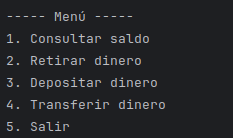
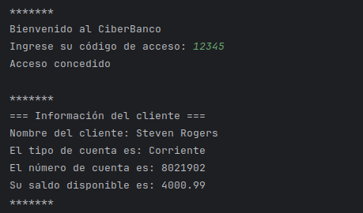
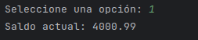
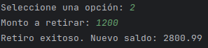
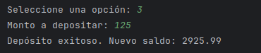
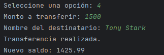
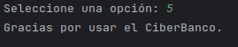

# Sistema Bancario – Consola en Java

Este proyecto es un sistema bancario desarrollado en **Java 21**, diseñado para que un cliente pueda iniciar sesión y realizar operaciones como **consultar saldo**, **retirar**, **depositar** y **transferir dinero**.

El sistema aplica conceptos de **Programación Orientada a Objetos**, como encapsulamiento, composición y modularidad.

---
## Características Principales

### Inicio de Sesión
El usuario ingresa un **código de acceso**.  
Si el código es incorrecto, puede reintentar o salir del sistema.

### Gestión de Clientes
Los clientes se cargan desde la clase `UsuariosBanco`, cada uno con:
- Nombre
- Código de acceso
- Cuenta bancaria asociada

### Operaciones Disponibles
- Consultar saldo
- Retirar dinero
- Depositar dinero
- Transferir dinero a otro cliente registrado
- Salir del sistema

---

## Requisitos

- **Java 21**
- IDE compatible: IntelliJ, Eclipse, NetBeans, VS Code, etc.
- No requiere base de datos ni librerías externas.

---

## Instalación y Ejecución

### 1. Descargar el Proyecto
Clona o descarga este repositorio.

### 2. Ejecutar la Aplicación
Abre y ejecuta la clase **Main.java** desde tu IDE.

### 3. Códigos para Iniciar Sesión
Puedes probar con cualquiera de estos accesos:

- `12345` – Steven Rogers
- `54321` – Tony Stark
- `11111` – Natasha Romanoff
- `22222` – Bruce Banner

---

## Capturas del Sistema

### Menú Principal
  
Pantalla inicial donde se muestran todas las opciones disponibles del sistema (consultar saldo, retirar, depositar, transferir o salir).

### Inicio de Sesión
  
Pantalla que solicita el código de acceso del usuario. Si es incorrecto, permite reintentarlo.

### Consulta de Saldo
  
Muestra el saldo actual disponible en la cuenta del cliente una vez que inició sesión.

### Retiro de Dinero
  
Aquí el usuario puede ingresar un monto a retirar.  
El sistema valida si existe saldo suficiente antes de completar la operación.

### Depósito de Dinero
  
Permite ingresar un monto para añadirlo al saldo de la cuenta.  
Al finalizar, muestra el nuevo saldo actualizado.

### Transferencia
  
El usuario ingresa el monto a transferir y el nombre del destinatario.  
El sistema verifica que el cliente exista y que el saldo sea suficiente.

### Salida del Sistema
  
Pantalla mostrada cuando el usuario elige la opción de salir del menú principal.

---

## Diagramas del Proyecto

Los diagramas están en:  
`anexos/diagramas/Diagramas.pdf`

Incluye:
- **Diagrama de Clases**
- **Diagrama de Caso de Uso**

---

## Funcionamiento General

1. El usuario inicia sesión con su código.
2. Se muestran sus datos y su cuenta bancaria.
3. El usuario selecciona la operación deseada desde el menú.
4. Las operaciones actualizan el saldo en tiempo real.
5. El sistema continúa ejecutándose hasta seleccionar *Salir*.  

